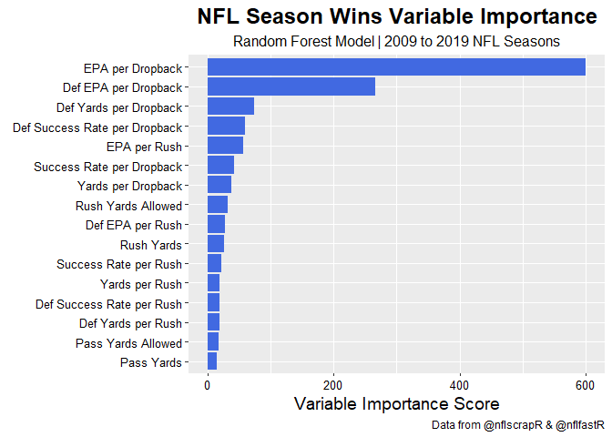
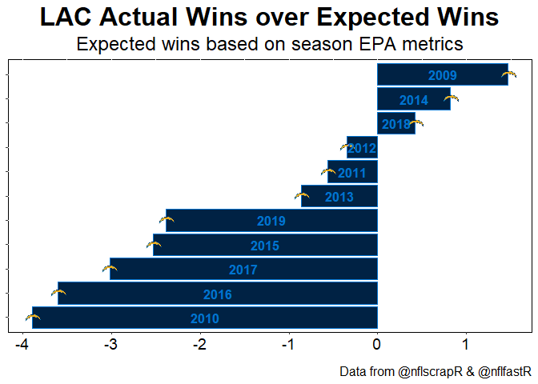
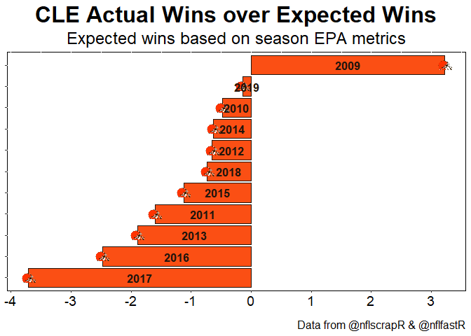

# Exploring Wins with nflscrapR
Austin Ryan | @packeRanalytics
May 17, 2020

What can 11 seasons worth of play-by-play data and some math tell us about what wins games in the NFL? 

Let's start with some simple linear regressions using metrics we can easily compute with nflscrapR and nflfastR data.

### Simple Linear Regression

<!-- -->

We can see passing efficiency metrics have the strongest relationships with wins. Furthermore, offensive passing efficiency metrics have stronger relationships than defensive passing metrics do. 

A team's expected points added per dropback explains nearly half of the variation in their season win total. Whereas defensive expected points added per dropback explain about 30% of the variation in wins. 

Offensive and defensive rushing efficiency metrics only explain about 15 and 8% of the variation in wins respectively. 

### Random Forest Variable Importance
We can also build a random forest model and let the model tell us what features yield the most information gain. Again the passing efficiency is the largest driver of wins and it is not particularly close.

<!-- -->

### Multiple Linear Regression
We know offensive and defensive EPA per dropback metrics are useful for explaining season win totals. Just for fun make a linear regression model that uses EPA per dropback and per rush for both sides of the ball. This regression explains 77% of the variation in season wins. 

We can use the regression formula to develop expected wins based on EPA per play metrics. The distribution of actual wins minus expected wins is normally distributed with a mean of 0 and a standard deviation of 1.5 wins. 

This means 68% of the season win totals from 2009-2019 are plus or minus 1.5 wins from what our expected wins formula predicts. Furthermore, 95% of the season win totals are within 3 games of what we would predict. Put another way, it is rare for a team to out or underperform their expected wins by more than 3 games.

<!-- -->

### What does this mean for the 2020 season?
Looking at prior teams in the right tail (those who over performed by more than 2.5 wins) we see that on average their average wins dropped by 1.7 games in the next season. 

In the left tail we see that teams who under performed by more than 2.5 wins increased their average wins by 2.4 games the next season. 

If we look at teams who over performed by more than 2 games we see their wins drop on average by 2.1 games the next season. Conversely, teams who under perform by more than 2 games increase their wins the next season by 2.9 games on average.

How did expected and actual wins look in 2019?

<!-- -->

Based on our expected wins formula the NFC North champs were predicted to have 10 wins while they actual won 13. Additionally, the team they beat to get to the NFC Championship looked more like an 8 win team rather than an 11 win team. 

On the other end of the spectrum the Cowboys produced EPA per play metrics that predicted an 11 win team, however, they ended up 3 wins short. Detroit also came up nearly 3 wins short of what was expected.

### Other findings that should surprise no one
The difference between actual and expected wins is largely a function of how a team performs in one score games and on special teams performance. Record in one score games isn't very stable year over year for the most part, however, a few teams did consistently out or over perform their expected wins. 

Of the 352 season long performances in the data only 24 teams under performed by more than 2.35 wins. The Chargers account for 25% of those seasons.

<!-- -->

The Browns have only over performed in one season.
<!-- -->

On the other end of the spectrum the Patriots have only underperformed by more than 1 game once.
<!-- -->
